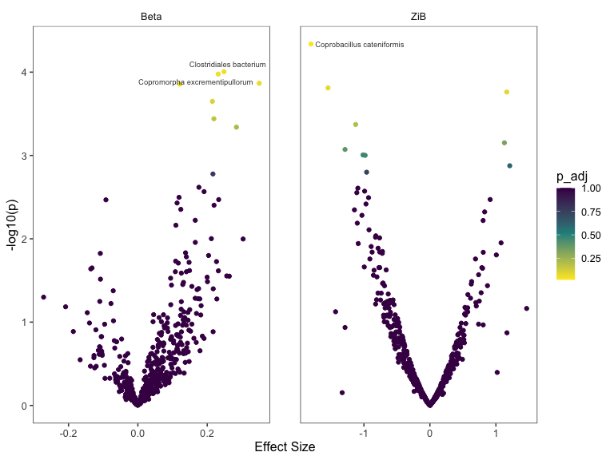
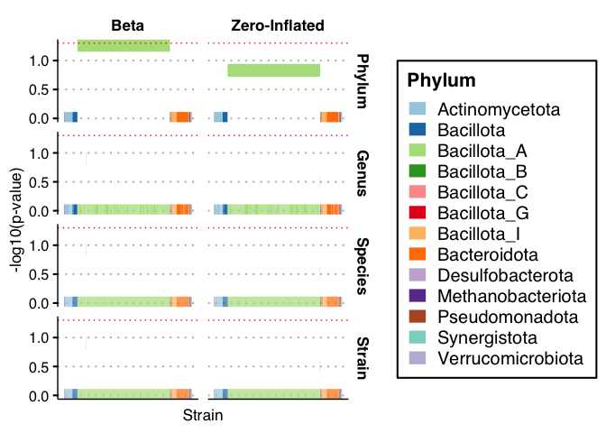
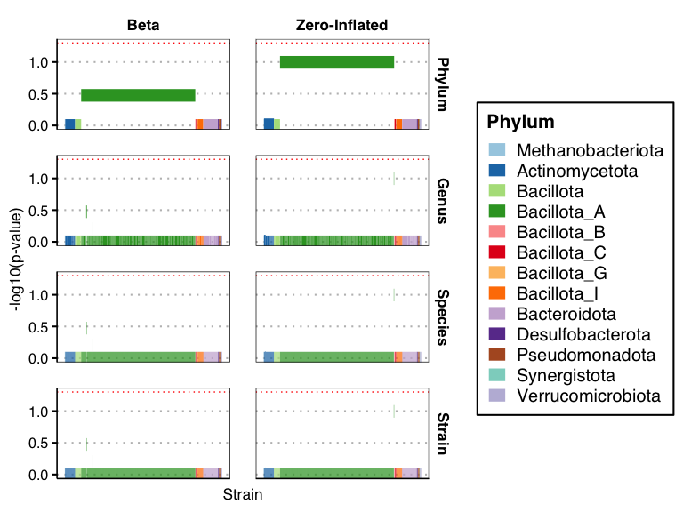
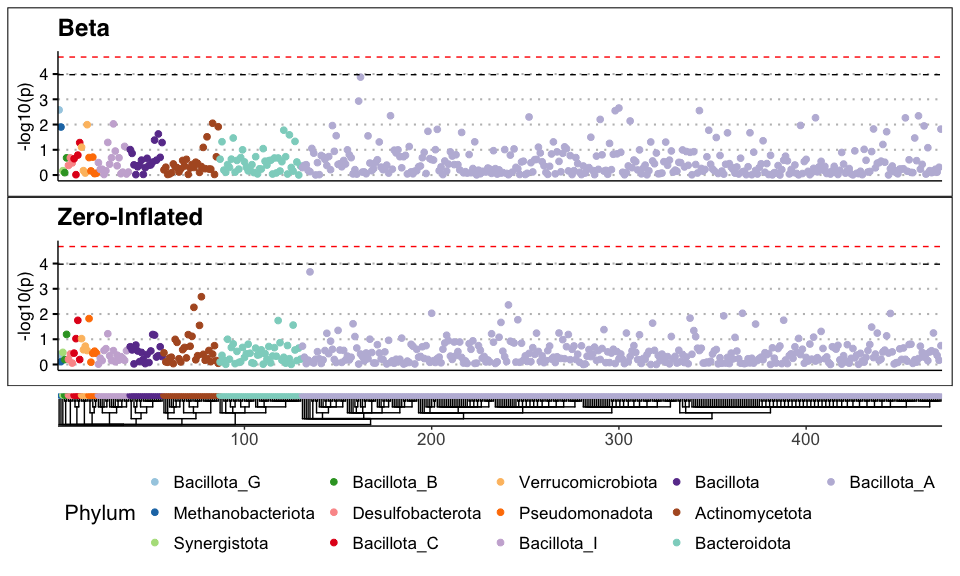

<!-- README.md is generated from README.Rmd. Please only edit the Rmd file -->

<!-- badges: start -->

[](https://github.com/gtonkinhill/strainspy/actions)
<!-- [](https://zenodo.org/badge/latestdoi/XXXX) -->
<!-- badges: end -->

# Strainspy

## Installation

`strainspy` is currently available on github. It can be installed with
`remotes`

``` r
install.packages("remotes")
remotes::install_github("gtonkinhill/strainspy")
```

If you would like to also build the vignette with your installation run:

``` r
remotes::install_github("gtonkinhill/strainspy", build_vignettes = TRUE)
```

## Example

This walkthrough demonstrates a typical `strainspy` analysis and
showcases some of the models and outputs available. Here, we analyse a
200 sample subset of the data described in [Wallen *et al.*
2022](https://doi.org/10.1038/s41467-022-34667-x).

**NOTE:** Be sure to replace the example paths with valid file paths on
your system. The `system.file()` function is used here only for
demonstration purposes in this vignette and will not work outside the
package environment.

``` r
library(strainspy)

example_meta_path <- system.file("extdata", "example_metadata.csv.gz", package = "strainspy")
example_sylph_path <- system.file("extdata", "example_sylph_profile.tsv.gz", package = "strainspy")
example_taxonomy_path <- system.file("extdata", "example_taxonomy.tsv.gz", package = "strainspy")
```

### Load and filter data

``` r
# Read in metadata
meta_data <- readr::read_csv(example_meta_path)
meta_data$Case_status = factor(meta_data$Case_status)  # Required for visualising
# Read in sylph profile
se <- read_sylph(example_sylph_path, meta_data)

# Filter by presence. This will remove any strains that are not present in at
# least 30 samples
se <- filter_by_presence(se, min_nonzero = 30)
#> Retained 472 rows after filtering
```

### Fit the model

``` r
# Create design matrix
design <- as.formula(" ~ Case_status + Age_at_collection")

# Fit a Zero-inflated beta model
fit <- glmZiBFit(se, design, nthreads = parallel::detectCores())
#>   |                                                                              |                                                                      |   0%  |                                                                              |==============                                                        |  20%  |                                                                              |============================                                          |  40%  |                                                                              |==========================================                            |  60%  |                                                                              |========================================================              |  80%  |                                                                              |======================================================================| 100%
```

### Summarise and plot the results

``` r
# Get top hits
top_hits(fit, alpha = 0.5)
#> # A tibble: 2 × 10
#>   Contig_name  Genome_file coefficient std_error p_value p_adjust zi_coefficient
#>   <chr>        <chr>             <dbl>     <dbl>   <dbl>    <dbl>          <dbl>
#> 1 QAND0100002… GCA_003150…      0.490     0.128  1.32e-4   0.0624         -0.250
#> 2 NZ_JAJEQM01… GCF_020687…      0.0198    0.0585 7.35e-1   1               1.30 
#> # ℹ 3 more variables: zi_std_error <dbl>, zi_p_value <dbl>, zi_p_adjust <dbl>

# Create Volcano plot
plot_volcano(fit, label = T, alpha = 0.5)
```



## Visualise the distribution of top hits with Case_status

### Including zeros

``` r
plot_ani_dist(se, "Case_status", top_hits(fit, alpha = 0.5)$Contig_name, show_points = T)
```



### Excluding zeros

``` r
plot_ani_dist(se, "Case_status", top_hits(fit, alpha = 0.5)$Contig_name, show_points = T,
    drop_zeros = T)
```


## Incorporate taxonomy

``` r
# Read in taxonomy
taxonomy <- read_taxonomy(example_taxonomy_path)

# Perform hierarchical multiple testing adjustment of p-values
hier_p <- hadjust(fit, taxonomy = taxonomy)
head(hier_p)
#> # A tibble: 6 × 6
#>   Level   Model Name               strain_count mean_coefficient p_adjust
#>   <chr>   <chr> <chr>                     <int>            <dbl>    <dbl>
#> 1 Phylum  Beta  Bacillota_A                 342           0.0261   0.0543
#> 2 Class   Beta  Clostridia                  342           0.0261   0.0543
#> 3 Order   Beta  Christensenellales           38           0.0925   0.0963
#> 4 Family  Beta  QAND01                        4           0.129    0.124 
#> 5 Genus   Beta  QAND01                        1           0.490    0.124 
#> 6 Species Beta  QAND01 sp003150225            1           0.490    0.124
```

### Create taxonomy informed Manhattan plot with adjusted p-values

``` r
plot_manhattan(fit, taxonomy = taxonomy)
```



### Create a traditional Manhattan plot coloured by taxonomy with unadjusted p-values and Bonferroni significance thresholds

``` r
plot_manhattan(fit, taxonomy = taxonomy, aggregate_by_taxa = F)
```

<!-- -->

## Example using Sourmash output

``` r
example_sourmash_path <- system.file("extdata", "example_sourmash.csv.gz", package = "strainspy")
sm <- read_sourmash(example_sourmash_path, meta_data)
```

All remaining functions are compatible with this output.

**Note:** `strainspy` provides a function to merge `sourmash gather` and
`sourmash search` outputs. See help for details.

## Example using MetaPhlAn output

``` r
example_metaphlan_path <- system.file("extdata", "metaphlan_merged.tsv.gz", package = "strainspy")
example_taxonomy_path <- system.file("extdata", "metaphlan_taxonomy.tsv.gz", package = "strainspy")
mp <- read_metaphlan(example_metaphlan_path, meta_data)
```

All remaining functions are compatible with this output.

**Note:** `strainspy` provides a function to merge `MetaPhlAn` profiles
and generate the taxonomy file. See help for details.

## Citation

To cite strainspy please use

<!-- ## Introduction -->

<!-- ```{r, echo = FALSE} -->

<!-- intro_rmd <- 'vignettes/introduction.Rmd' -->

<!-- raw_rmd <- readLines(intro_rmd) -->

<!-- # remove yaml  -->

<!-- yaml_lines <- grep("---", raw_rmd) -->

<!-- # remove appendix (session info) -->

<!-- appendix <- grep("Appendix", raw_rmd) -->

<!-- compressed_rmd <- raw_rmd[c(-seq(yaml_lines[1], yaml_lines[2], by = 1),  -->

<!--                             -seq(appendix, length(raw_rmd)))] -->

<!-- writeLines(compressed_rmd, "child.Rmd") -->

<!-- ``` -->

<!-- ```{r, child = 'child.Rmd'} -->

<!-- ``` -->

<!-- ```{r cleanup, echo=FALSE, include=FALSE} -->

<!-- if (file.exists("child.Rmd")) { -->

<!--   file.remove("child.Rmd") -->

<!-- } -->

<!-- ``` -->
