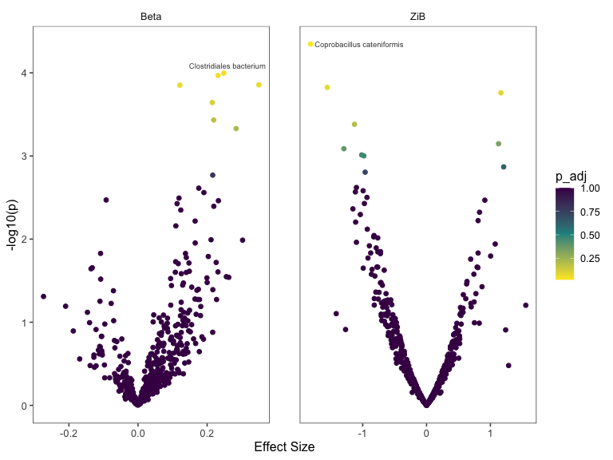
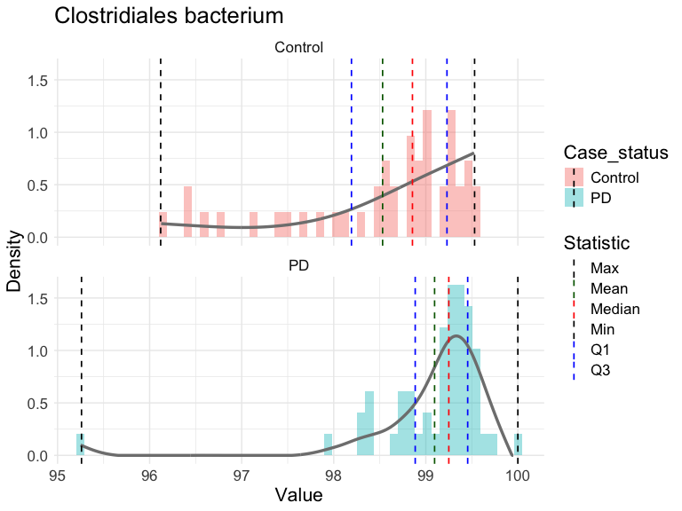
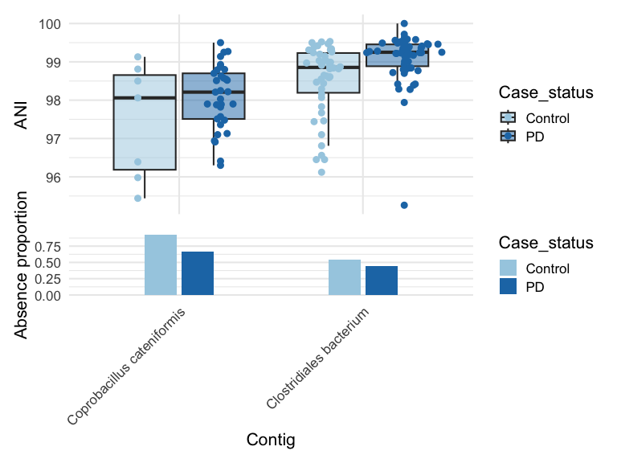
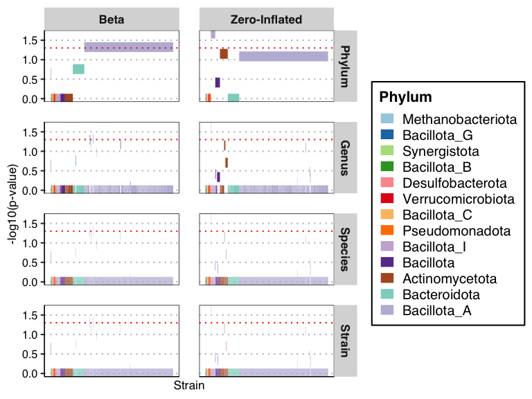
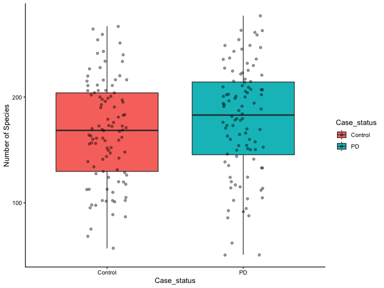

<!-- README.md is generated from README.Rmd. Please only edit the Rmd file -->

<!-- badges: start -->

[](https://github.com/gtonkinhill/strainspy/actions)
[](https://zenodo.org/records/21796878)
<!-- badges: end -->

# Strainspy

## Installation

`StrainSpy` is currently available on github. It can be installed with
`remotes`

``` r
install.packages("remotes")
remotes::install_github("gtonkinhill/strainspy")
```

If you would like to also build the vignette with your installation run:

``` r
remotes::install_github("gtonkinhill/strainspy", build_vignettes = TRUE)
```

A full set of examples and analyses performed using `StrainSpy` are
available [here](https://sudaraka88.github.io/strainspy-manuscript/).

Several useful notes for using StrainSpy with your own data is provided
at the [end of this read me](#analysing-your-own-data).

## Quick Start

This quick start demonstrates a typical `StrainSpy` analysis and
showcases some of the models and outputs available. Here, we analyse a
200 sample subset of the data described in [Wallen *et al.*
2022](https://doi.org/10.1038/s41467-022-34667-x).

``` r
library(strainspy)
library(ggplot2)

example_meta_path <- system.file("extdata", "example_metadata.csv.gz", package = "strainspy")
example_sylph_path <- system.file("extdata", "example_sylph_profile.tsv.gz", package = "strainspy")
example_taxonomy_path <- system.file("extdata", "example_taxonomy.tsv.gz", package = "strainspy")
```

**NOTE:** When analysing your own data, be sure to replace these example
paths with valid file paths on your system. The `system.file()` function
is used here only for demonstration purposes in this vignette.

### Load and filter data

``` r
# Read in metadata
meta_data <- readr::read_csv(example_meta_path)

meta_data$Case_status = factor(meta_data$Case_status)  # Required for visualising
# Read in sylph profile
se <- read_sylph(example_sylph_path, meta_data = meta_data)

# Filter by presence. This will remove any strains that are not present in at
# least 30 samples
se <- filter_by_presence(se, min_nonzero = 30)
#> Retained 472 rows after filtering

# Read in taxonomy
taxonomy <- read_taxonomy(example_taxonomy_path)
```

### Fit the model

``` r
# Create design matrix
design <- as.formula(" ~ Case_status + Age_at_collection")

# Fit a Zero-inflated beta model using the default preset_weak MAP prior
fit <- glmZiBFit(se, design, nthreads = parallel::detectCores())
#> Fitting model... 
#>   |                                                                              |                                                                      |   0%  |                                                                              |==============                                                        |  20%  |                                                                              |============================                                          |  40%  |                                                                              |==========================================                            |  60%  |                                                                              |========================================================              |  80%  |                                                                              |======================================================================| 100%
```

### Summarise and plot the results

``` r
# Get top hits
th = top_hits(fit, coef = 2)
#> Found 2 tophits for Case_statusPD at alpha = 0.05 using holm

# Create Volcano plot
plot_volcano(fit, label = T)
#> Found 472 tophits for Case_statusPD at alpha = 1 using holm
```



``` r

knitr::kable(th)
```

| Contig_name | Genome_file | coefficient | std_error | p_value | p_adjust | zi_coefficient | zi_std_error | zi_p_value | zi_p_adjust |
|:---|:---|---:|---:|---:|---:|---:|---:|---:|---:|
| NZ_WSNW01000023.1 Coprobacillus cateniformis strain RCA1-24 10234_10235, whole genome shotgun sequence | GCF_009767585.1 | 0.1667314 | 0.1243133 | 0.1798493 | 1.0000000 | -1.8172219 | 0.4454086 | 0.0000451 | 0.0212661 |
| UREB01000001.1 uncultured Clostridiales bacterium isolate UMGS913 genome assembly, contig: NODE_380_length_41473_cov_4.232942, whole genome shotgun sequence | GCA_900546685.1 | 0.2481419 | 0.0638069 | 0.0001007 | 0.0475203 | -0.3495862 | 0.2874739 | 0.2239611 | 1.0000000 |

*Coprobacillus cateniformis* shows difference in presence (adjusted p =
0.0213). *Clostridiales bacterium* shows difference in identity
(adjusted p \< 0.01).

### Perform post-hoc testing to validate the beta hit

``` r
th = comp_ani_diff_and_posthoc_test(se, fit, th)
#>   |                                                                              |                                                                      |   0%  |                                                                              |======================================================================| 100%

# This NA indicates posthoc testing does not invalidate this beta hit
is.na(th$Comment)
#> [1] TRUE TRUE

th$ANI_Difference
#> [1]        NA 0.2481419
```

In *Clostridiales bacterium*, average ANI (green dashed line) is 0.25%
lower in Controls compared to Parkinson Disease (PD). The distribution
appears different between groups.

## Visualise the distribution of top hits with Case_status

``` r
plot_ani_dist(se, "Case_status", top_hits(fit)$Contig_name)
#> Found 2 tophits for Case_statusPD at alpha = 0.05 using holm
```


``` r
plot_histogram(se, "Case_status", top_hits(fit)$Contig_name[2], drop_zeros = TRUE,
    fit_spline = T, bins = 54, separate_facets = T)
#> Found 2 tophits for Case_statusPD at alpha = 0.05 using holm
```



## Incorporate taxonomy

### Generate taxonomy informed Manhattan plot with adjusted p-values

``` r
plot_manhattan(fit, taxonomy = taxonomy)
```



### Create a traditional Manhattan plot coloured by taxonomy with unadjusted p-values and Bonferroni significance thresholds

``` r
plot_manhattan(fit, taxonomy = taxonomy, aggregate_by_taxa = F)
```

<!-- -->

## Estimate sample richness

This can be used as a proxy for alpha diversity.

``` r
rchns = estimate_sample_richness(se, taxonomy)$species_richness
df_rch = merge(data.frame(run_accession = names(rchns), value = rchns), meta_data,
    by = "run_accession")

ggplot(df_rch, aes(Case_status, value, fill = Case_status)) + geom_boxplot(outlier.shape = NA) +
    geom_jitter(width = 0.15, alpha = 0.4) + theme_classic() + ylab("Number of Species")
```



## Estimate between sample diversity

``` r
divs = strainspy::estimate_beta_diversity(se, phenotype = "Case_status", return_plots = T)

divs$plots$NMDS
```


## Working with other inputs

### Example using Sourmash output

``` r
example_sourmash_path <- system.file("extdata", "example_sourmash.csv.gz", package = "strainspy")
sm <- read_sourmash(example_sourmash_path, meta_data)
```

All remaining functions are compatible with this output.

**Note:** `strainspy` provides a function to merge `sourmash gather` and
`sourmash search` outputs. See help for details.

### Example using MetaPhlAn output

``` r
example_metaphlan_path <- system.file("extdata", "metaphlan_merged.tsv.gz", package = "strainspy")
example_taxonomy_path <- system.file("extdata", "metaphlan_taxonomy.tsv.gz", package = "strainspy")
mp <- read_metaphlan(example_metaphlan_path, meta_data)
```

All remaining functions are compatible with this output.

**Note:** `strainspy` provides a function to merge `MetaPhlAn` profiles
and generate the taxonomy file. See help for details.

# Analysing your own data

To analyse your own metagenomic data with StrainSpy, you first need to
profile your metagenomes.

### Profiling using Sylph

We recommend using `Sylph query` with the [99%
GTDB](https://zenodo.org/records/21796878) database for strain-level
analysis.

See the [Sylph
documentation](https://sylph-docs.github.io/install%2Bquickstart/) for
full installation details.

For paired-end reads, a typical command is:

    sylph query "$db_path" -u --read-seq-id 99.9 -t "$num_cpu_threads$ -1 "$R1" -2 "$R2" -o "$out.tsv"

For each metagenome, you need to provide the input path to the sylph
database (`$db_path`), the number of threads to use
(`$num_cpu_threads`), paths to forward and reverse reads (`$R1` and
`$R2`), and the output path for the results (`$out.tsv`). For single-end
read data, use:

    sylph query "$db_path" -u --read-seq-id 99.9 -t "$num_cpu_threads$ -r "$reads" -o "$out.tsv"

This will create a unique output `tsv` file for each metagenome.

### Combining Sylph outputs

`StrainSpy` provides a function `merge_sylph_files()` to combine
multiple Sylph output files into a single file. Alternatively, you can
do this in bash. See [below](#running-sylph-on-an-hpc-cluster).

**Tip:** Make sure that all output files were generated using the same
Sylph database and analysis settings (i.e., `query` or `profile`).

### Running Sylph on an HPC cluster

Running Sylph separately on hundreds or thousands of metagenomes can be
cumbersome, particularly when the metagenomic reads need to be
downloaded from a public repository. Several useful bash scripts are
available
[here](https://github.com/Sudaraka88/slurm_scripts/tree/main/sylph_download_run_detele)
to download and use. These are written to automatically download, run
Sylph, and delete the metagenomic reads, followed by merging Sylph
outputs to a single tsv file ready for `StrainSpy`.

### Taxonomy data

Relevant taxonomy `tsv` files for each database is available for
download at [Zenodo](https://zenodo.org/records/21796878).

### Metadata

A metadata `tsv` file (optionally `gz` compressed) needs to be prepared
for each dataset before analysis. Each sample should be in a single row,
and each column should contain a metadata variable. The first column
should be named `run_accession` and contain the unique sample
identifiers that exactly match the Sylph output file. See the example
files provided with the package for guidance, available at
`inst/extdata/`.

## Citation

To cite strainspy please use
